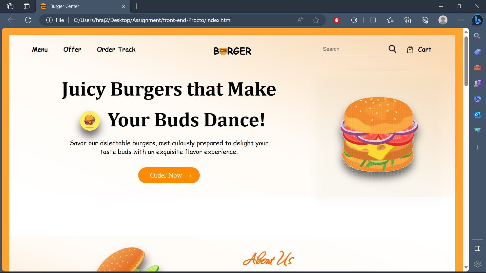

# Burger Center Website

## Table of Contents

1. [Introduction](#introduction)
2. [Features](#features)
3. [Installation](#installation)
4. [Usage](#usage)
5. [Technologies Used](#technologies-used)

## Introduction

The **Burger Center** website is a simple and visually appealing webpage that demonstrates best practices in web development, including semantic HTML, responsive design, and CSS styling. It serves as a project assignment for the Frontend Development division, showcasing the skills and techniques used to create an accessible and user-friendly website.

## Features

- **Semantic HTML**: The website uses semantic HTML elements like `<header>`, `<nav>`, `<main>`, and `<footer>` for improved accessibility and SEO.

- **Responsive Design**: It adapts seamlessly to various screen sizes, ensuring a consistent and user-friendly experience on different devices.

- **CSS Styling**: CSS styles are carefully crafted to create an attractive and harmonious visual design, including gradients, drop shadows, and responsive images.

- **JavaScript Functionality**: A JavaScript function is implemented for mobile navigation, enhancing user interaction.

## Installation

To run this project locally, follow these steps:

1. Clone the repository: `git clone https://github.com/yourusername/burger-center.git`
2. Navigate to the project directory: `cd burger-center`
3. Open the `index.html` file in your preferred web browser.

## Usage

- Explore the website's various sections, including the header, main content, about us, popular dishes, new product banner, and newsletter subscription.

- Interact with the navigation menu and experience the responsive design as you resize your browser window.

## Technologies Used

- HTML5
- CSS3
- JavaScript

